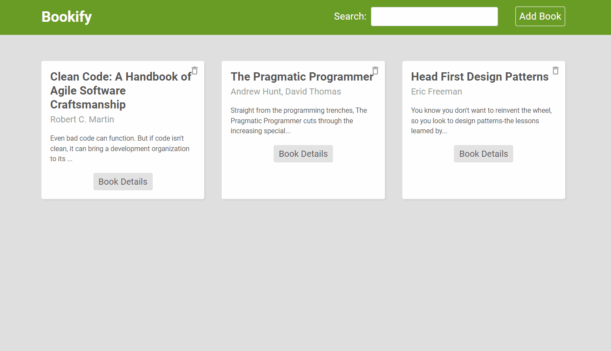

<h1 align="center">
   
  
</h1>

<h4 align="center">A book directory that lists all your favourite titles.</h4>

## Features

* React.js frontend
* Firebase backend 
* Hosted via firebase
* add / delete titles

